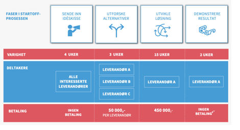

## Beskrivelse av caset

### Hvem har spilt inn dette caset

Caset ble først presentert i forbindelse med søknad om MedFin-midler. Behovet er senere bekreftet blant annet gjennom Fag- og prioriteringsutvalget. Alle som har hatt flere barn i barnehage/skole kjenner dessuten til problemet.

### Kort beskrivelse av caset

Caset dreier seg om å lage en enkel og felles kanal for løpende dialog mellom hjemmet og barnehage/SFO/skole, og gjøre det mulig for foreldre og foresatte å bare kunne forholde seg til en kanal.

### Hvilket problem adresserer caset/Hva fungerer dårlig i dag?

Det finnes mange gode løsninger for kommunikasjon mellom barnehage/SFO og skole på den ene siden og de foresatte på den andre. Forskjellige apper som Transponder, IST Home, Visma InSchool/Flyt og Showbie har i og for seg god funksjonalitet. I tillegg brukes kanaler som SMS, e-post og tradisjonell ranselpost.

Problemet for foreldrene er å holde styr på antall kanaler. Har du flere barn risikerer du å måtte forholde deg til mange ulike apper som gjør omtrent det samme. Det er ikke en gang nødvendigvis slik at SFO/AKS og skolen bruker samme løsning. I tillegg kan den enkelte lærer bruke egne kanaler. Foruten at dette er uoversiktlig gjør det også at historikken går tapt.

### Hvor oppstår brudd i informasjonsflyt eller ansvar?

Det er ingen som i det daglige har ansvar for den helhetlige kommunikasjonen mellom kommunen og de foresatte. Barnehager, SFO/AKS og skoler bruker de kanalene som de mener fungerer best til sitt formål, egentlig uten å ta hensyn til mottakeren.

### Hvem er de primære aktørene som berøres

- Foresatte
- Elever
- Ansatte i barnehager, SFO/AKS og skoler
- Systemleverandører

### Hva er konsekvensene for aktørene av dagens situasjon.

En forutsetning for god og fruktbar involvering fra hjemmet gjennom utdanningsløpet, er god kommunikasjon. Om selve det å kommunisere kjennes tung, vil listen for å ta opp ting og bidra aktivt bli høyere. Det er dessuten en risiko for at viktig informasjon ikke når fram, men «drukner» i ulike kanaler.

Det uoversiktlige bildet gjør det også mer komplisert å håndtere den enkelte foresattes krav til å motta informasjon, spesielt når de foresatte ikke bor sammen og kanskje kommuniserer dårlig seg i mellom.

### Hvordan kan en ønskesituasjon (drømmereise) se ut?

Det er ganske åpenbart at for foreldre vil det aller beste være at all kommunikasjon som berører barnet går gjennom en kanal. Løsningen må ha lav brukerterskel og egne seg til å bruke på mobile enheter og må kunne integreres med standard kalender-løsninger.\
For at løsningen skal kunne fungere og brukes fullt ut må grensesnittet mot barnehage, SFO/AKS og skole være like enkelt og helst integrert i fagsystemene.

En ideell løsning bør også åpne for at frivillig sektor kan bruke den slik at meldinger rundt barn som deltar i idrettslag, korps, speider, dans og andre fritidsaktiviteter inngår i samme løsning.

### Innsiktarbeid

SAMT-BU er ikke kjent med at det er gjort innsiktsarbeide knyttet spesifikt til dette caset. Det antas imidlertid at det finnes mye kunnskap om foresattes behov både i kommunene og i sektoren for øvrig. Selv om mye av innsikten som er opparbeidet ofte knytter seg til elever med spesielle behov, vil det være relevant også på mer generell basis.

### Hvilke av prosjektet målsetninger mener vi at caset berører?

Caset er et svært godt case for SAMT-BU fordi det er et av få caser som direkte adresserer sluttbrukeres behov. Fordi det dreier seg om å gi tilgang til data som brukerne allerede skal ha tilgang til, antas det også at det er få juridiske hindre. I og med at det dreier seg om å samle data fra mange kilder og vise det fram, vil utvikling av felles informasjonsmodeller og grensesnitt være helt sentralt.

Av SAMT-BUs målsetninger treffer det:

- Felles informasjonsmodeller og standardiserte grensesnitt som på sikt dekker «alle» områder og sektorer.
- Gjenbrukbare løsninger og fellesløsninger
- Enklere brukerreiser for ansatte, foresatte, elever og studenter gjennom læringsløpet - fra barnehage til grunnskole, videregående og høyere utdanning.
- Samarbeid og innovasjon på tvers av offentlige og private aktører i økosystemet, og økt konkurranse i markedet.
- Langsiktige mål om livslang læring m.m.
- Skalering og overføring av prosjektets læring og produkter til andre områder og sektorer, etter pilotering i dette prosjektet.

### Litt om gjennomføring

Det finnes allerede gode løsninger som rent teknisk og funksjonelt dekker behovene som er beskrevet over, og det er derfor ikke noe godt alternativ at det offentlige setter i gang og lager konkurrerende løsninger. Vi tror at dette er en utfordring som markedet vil kunne løse på en god måte, og ser for oss et økosystem der ulike leverandører og startups kan lage ulike «foreldre-apper» som høster kommunikasjonsdata fra kommunens og frivillighetens fagsystemer. Hvilke forretningsmodeller leverandørene velger er naturligvis opp til dem, men det er et hovedpoeng at løsningene skal være uavhengig av kommunegrenser og fagsystem i den enkelte kommune. Det er foreldrene og ikke kommunen som velger løsning og det er foreldrenes gunst leverandørene skal konkurrere om.

SAMT-BUs oppgave vil bli å legge til rette for at kommunikasjonsdataene blir tilgjengelige. I en pilot vil vi derfor måtte kartlegge hvilke løsninger og formater som eksisterer og hvilke avtale- eller regelverksmessige endringer som må til for å «frigjøre» dataene. Det bør også vurderes om data skal gjøre tilgjengelig f eks gjennom Min Kommune eller dataplattformen til KS Digital.

For å initiere utvikling av relevante løsninger tenker vi å se hen til StartOff-programmet. StartOff var et program for innovative anskaffelser, hvor offentlige oppdragsgivere fikk utviklet løsninger på sine behov, gjennom en prosess spesialtilpasset oppstartsselskaper. Programmet er nå avsluttet, men denne innovative anskaffelsesmetodikken kan fortsatt benyttes. (<https://www.anskaffelser.no/innovasjon/startoff>).

StartOff-prosessen er delt opp i ulike faser:

- **Nullfase:** før prosjektoppstart bistår StartOff med å definere og finne riktig utfordring og omfang.
- **Identifisere behov:** i de tre første ukene av prosessen blir utfordringen omformulert til et behov, som artikuleres i et behovsdokument.
- **Invitere til idéskisse:** sammen med konkurransereglene og idéskissemalen blir behovsdokumentet og utfordringsvideoen utlyst som en konkurranse, hvor startups har fire uker på å sende inn sin idéskisse.
- **Evaluere idéskisser:** De seks beste idéskissene velges ut til intervju, og de tre beste selskapene velges til neste fase.
- **Utforske alternativer:** I denne fasen har selskapene tre uker på seg til å utvikle et fullstendig løsningsforslag mot et vederlag på 50 000,-. Ved slutten av disse tre ukene pitcher selskapene sine løsninger og en vinner velges.
- **MVP-utvikling:** Vinnerselskapet får et vederlag på 450 000,- og har 15 uker på å utvikle en minimumsløsning (MVP), som deretter demonstreres.
- **Veien videre:** Ved fullstendig MVP går prosjektet over i en ordinær anskaffelse, i videreutvikling eller andre former for veien videre.
